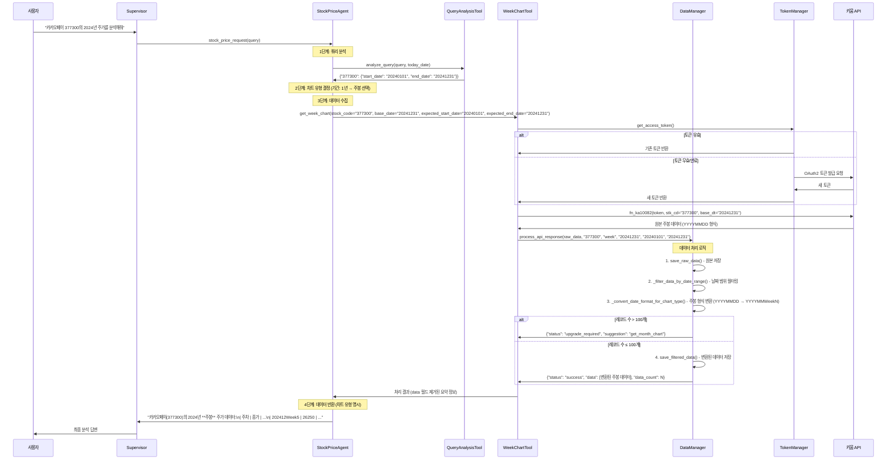

# Stockreport-reader

**미래에셋증권 AI 페스티벌** |  AI Service 부문 [🔗](https://miraeassetfesta.com/)

---

## Stock Price 에이전트

키움증권 REST API를 사용하여 차트 데이터를 조회합니다.

```mermaid
sequenceDiagram
    participant U as 사용자
    participant SV as Supervisor
    participant SPA as StockPriceAgent
    participant QA as QueryAnalysisTool
    participant WCT as WeekChartTool
    participant DM as DataManager
    participant TM as TokenManager
    participant K as 키움 API

    U->>SV: "카카오페이 377300의 2024년 주가를 분석해줘"
    SV->>SPA: stock_price_request(query)
    
    Note over SPA: 1단계: 쿼리 분석
    SPA->>QA: analyze_query(query, today_date)
    QA->>SPA: {"377300": {"start_date": "20240101", "end_date": "20241231"}}
    
    Note over SPA: 2단계: 차트 유형 결정 (기간: 1년 → 주봉 선택)
    
    Note over SPA: 3단계: 데이터 수집
    SPA->>WCT: get_week_chart(stock_code="377300", base_date="20241231", expected_start_date="20240101", expected_end_date="20241231")
    
    WCT->>TM: get_access_token()
    alt 토큰 유효
        TM->>WCT: 기존 토큰 반환
    else 토큰 무효/만료
        TM->>K: OAuth2 토큰 발급 요청
        K->>TM: 새 토큰
        TM->>WCT: 새 토큰 반환
    end
    
    WCT->>K: fn_ka10082(token, stk_cd="377300", base_dt="20241231")
    K->>WCT: 원본 주봉 데이터 (YYYYMMDD 형식)
    
    WCT->>DM: process_api_response(raw_data, "377300", "week", "20241231", "20240101", "20241231")
    
    Note over DM: 데이터 처리 로직
    DM->>DM: 1. save_raw_data() - 원본 저장
    DM->>DM: 2. _filter_data_by_date_range() - 날짜 범위 필터링
    DM->>DM: 3. _convert_date_format_for_chart_type() - 주봉 형식 변환 (YYYYMMDD → YYYYMMWeekN)
    
    alt 레코드 수 > 100개
        DM->>WCT: {"status": "upgrade_required", "suggestion": "get_month_chart"}
    else 레코드 수 ≤ 100개
        DM->>DM: 4. save_filtered_data() - 변환된 데이터 저장
        DM->>WCT: {"status": "success", "data": [변환된 주봉 데이터], "data_count": N}
    end
    
    WCT->>SPA: 처리 결과 (data 필드 제거된 요약 정보)
    
    Note over SPA: 4단계: 데이터 반환 (차트 유형 명시)
    SPA->>SV: "카카오페이(377300)의 2024년 **주봉** 주가 데이터:\n| 주차 | 종가 | ...\n| 202412Week5 | 26250 | ..."
    SV->>U: 최종 분석 답변
```
