# Multi-Agent System Documentation
## ChatClovaX & LangGraph Based Stock Analysis Platform

---

## Table of Contents
1. [System Overview](#system-overview)
2. [Architecture Diagrams](#architecture-diagrams)
3. [Agent System Structure](#agent-system-structure)
4. [Data Flow Analysis](#data-flow-analysis)
5. [API Integration](#api-integration)
6. [State Management](#state-management)
7. [Technology Stack](#technology-stack)
8. [Extension Points](#extension-points)

---

## System Overview

This is a comprehensive multi-agent system built with **ChatClovaX (HCX-005)** and **LangGraph** for analyzing stock market data and documents. The system combines PDF document processing with stock chart  analysis through a coordinated agent architecture.

### Core Components
- **Frontend**: React 19 + TypeScript + Tailwind CSS
- **Backend**: FastAPI + LangGraph + ChatClovaX
- **Multi-Agent System**: Supervisor + Worker Agent Pattern
- **Data Sources**: Kiwoom REST API, PDF Documents

---

## Architecture Diagrams

### 1. High-Level System Architecture

### 2. Multi-Agent System Architecture

```mermaid
graph TB
    subgraph "LangGraph Multi-Agent System"
        subgraph "Supervisor Layer"
            Supervisor[Supervisor Agent<br/>ChatClovaX HCX-005<br/>🎯 Coordinator & Router]
        end
        
        subgraph "Worker Agents"
            StockAgent[Stock Price Agent<br/>ChatClovaX HCX-005<br/>📊 Stock Data Analysis]
            SearchAgent[✅ Search Agent<br/>ChatClovaX HCX-005<br/>🔍 Web Search & News Analysis<br/>Tavily + Naver News]
            DARTAgent[🔜 DART Agent<br/>ChatClovaX HCX-005<br/>📈 Corporate Filings Analysis]
        end
        
        subgraph "Shared Components"
            State[MessagesState<br/>📝 Shared State]
            Graph[LangGraph<br/>🔄 Workflow Engine]
        end
        
        subgraph "Tools & APIs"
            KiwoomTools[Kiwoom API Tools<br/>📡 Chart Data Retrieval]
            SearchTools[✅ Search & News Tools<br/>🌐 Tavily Web Search + 📰 Naver News + 🔗 Content Crawling]
            DARTTools[🔜 DART API Tools<br/>📊 Corporate Filings Retrieval]
        end
    end
    
    User[👤 User Query] --> Supervisor
    Supervisor -->|handoff| StockAgent
    Supervisor -->|handoff| SearchAgent
    Supervisor -.->|future| DARTAgent
    
    StockAgent --> KiwoomTools
    SearchAgent --> SearchTools
    DARTAgent -.-> DARTTools
    
    StockAgent --> State
    SearchAgent --> State
    DARTAgent -.-> State
    
    State --> Graph
    Graph --> Supervisor
    
    style Supervisor fill:#e3f2fd
    style StockAgent fill:#f3e5f5
    style SearchAgent fill:#e8f5e8
    style DARTAgent fill:#fff3e0,stroke-dasharray: 5 5
    style State fill:#fce4ec
```

### 3. Current Agent Interaction Flow

---

## Agent System Structure

### 4. Supervisor Agent Internal Architecture

```mermaid
flowchart TD
    subgraph "Supervisor Agent (ChatClovaX HCX-005)"
        Prompt[System Prompt<br/>📋 Date-aware Instructions]
        LLM[ChatClovaX HCX-005<br/>🧠 Core Intelligence]
        Tools[Handoff Tools<br/>🔧 Worker Agent Connectors]
        
        subgraph "Tool Registry"
            StockTool[call_stock_price_agent<br/>📊 Stock Analysis Tool]
            NewsTool[🔜 call_news_agent<br/>📰 News Analysis Tool]
            DARTTool[🔜 call_dart_agent<br/>📈 Corporate Filings Analysis Tool]
        end
        
        subgraph "Manual Supervisor Implementation"
            ReactAgent[create_react_agent<br/>🔄 LangGraph ReAct Pattern]
            Workflow[StateGraph Workflow<br/>START → supervisor → END]
        end
    end
    
    UserQuery[User Query] --> Prompt
    Prompt --> LLM
    LLM --> Tools
    Tools --> StockTool
    Tools -.-> NewsTool
    Tools -.-> DARTTool
    
    ReactAgent --> LLM
    ReactAgent --> Tools
    Workflow --> ReactAgent
    
    style LLM fill:#e1f5fe
    style StockTool fill:#f3e5f5
    style NewsTool fill:#e8f5e8,stroke-dasharray: 5 5
    style DARTTool fill:#fff3e0,stroke-dasharray: 5 5
```

### 5. Stock Price Agent Internal Architecture

```mermaid
flowchart TD
    subgraph "Stock Price Agent (ChatClovaX HCX-005)"
        StockLLM[ChatClovaX HCX-005<br/>🧠 Stock Analysis Intelligence]
        StockPrompt[Stock Analysis Prompt<br/>📋 Date-formatted Instructions]
        
        subgraph "LangChain Tools"
            MinuteTool[get_minute_chart<br/>⏱️ 1-60분 데이터]
            DayTool[get_day_chart<br/>📅 일봉 데이터]
            WeekTool[get_week_chart<br/>📆 주봉 데이터]
            MonthTool[get_month_chart<br/>🗓️ 월봉 데이터]
            YearTool[get_year_chart<br/>📊 년봉 데이터]
        end
        
        subgraph "React Agent System"
            ReactEngine[create_react_agent<br/>🔄 Tool-calling Engine]
            ThoughtAction[Thought → Action → Observation<br/>🤔 ReAct Loop]
        end
        
        subgraph "Data Processing Layer"
            KiwoomAPI[Kiwoom API Client<br/>📡 Chart Data Access]
            DataManager[Data Manager<br/>📊 Processing & Indicators]
            TechIndicators[Technical Indicators<br/>📈 SMA, EMA, MACD, RSI, etc.]
        end
    end
    
    StockLLM --> StockPrompt
    StockLLM --> ReactEngine
    ReactEngine --> ThoughtAction
    ThoughtAction --> MinuteTool
    ThoughtAction --> DayTool
    ThoughtAction --> WeekTool
    ThoughtAction --> MonthTool
    ThoughtAction --> YearTool
    
    MinuteTool --> KiwoomAPI
    DayTool --> KiwoomAPI
    WeekTool --> KiwoomAPI
    MonthTool --> KiwoomAPI
    YearTool --> KiwoomAPI
    
    KiwoomAPI --> DataManager
    DataManager --> TechIndicators
    
    style StockLLM fill:#f3e5f5
    style ReactEngine fill:#e8f5e8
    style KiwoomAPI fill:#fff3e0
    style DataManager fill:#fce4ec
```

---

## Data Flow Analysis

### 6. Complete Data Flow Pipeline

```mermaid
flowchart LR
    subgraph "Input Layer"
        UserQuery[👤 User Query<br/>삼성전자 Q1 분석]
        PDFUpload[📄 PDF Upload<br/>Research Reports]
    end
    
    subgraph "Processing Layer"
        subgraph "Supervisor Processing"
            Parse[🔍 Query Parsing<br/>Extract: 종목, 기간, 목적]
            Route[🎯 Agent Routing<br/>Determine: Stock/News/DART]
            Coordinate[🤝 Result Coordination<br/>Integrate responses]
        end
        
        subgraph "Stock Agent Processing"
            Analyze[📊 Stock Analysis<br/>Period & Chart Selection]
            Fetch[📡 Data Fetching<br/>Kiwoom API Calls]
            Process[⚙️ Data Processing<br/>Technical Indicators]
            Report[📋 Analysis Report<br/>7-section format]
        end
        
        subgraph "PDF Processing"
            Extract[📄 Text Extraction<br/>PyPDF2]
            Chunk[🧩 Chunking<br/>BBox Creation]
            Store[💾 Storage<br/>processed/]
        end
    end
    
    subgraph "Output Layer"
        Response[📝 Final Response<br/>Structured Analysis]
        PDF_UI[🖥️ PDF Viewer<br/>Chunk Overlays]
        Chat_UI[💬 Chat Interface<br/>Streaming Responses]
    end
    
    UserQuery --> Parse
    Parse --> Route
    Route --> Analyze
    Analyze --> Fetch
    Fetch --> Process
    Process --> Report
    Report --> Coordinate
    Coordinate --> Response
    Response --> Chat_UI
    
    PDFUpload --> Extract
    Extract --> Chunk
    Chunk --> Store
    Store --> PDF_UI
    
    style Parse fill:#e3f2fd
    style Route fill:#e3f2fd
    style Analyze fill:#f3e5f5
    style Process fill:#f3e5f5
    style Extract fill:#e8f5e8
```

### 7. State Management Flow

---

## API Integration

### 8. API Architecture & Endpoints

### 9. Request/Response Flow

---

## Technology Stack

### 10. Technology Stack Overview

```mermaid
graph TB
    subgraph "Frontend Stack"
        React[React 19<br/>🔄 Component Framework]
        TS[TypeScript<br/>🔒 Type Safety]
        Tailwind[Tailwind CSS<br/>🎨 Styling]
        Vite[Vite<br/>⚡ Build Tool]
        Zustand[Zustand<br/>🗃️ State Management]
        ReactPDF[react-pdf<br/>📄 PDF Rendering]
        Vitest[Vitest<br/>🧪 Testing Framework]
    end
    
    subgraph "Backend Stack"
        FastAPI[FastAPI<br/>🚀 Web Framework]
        LangGraph[LangGraph<br/>🕸️ Agent Orchestration]
        LangChain[LangChain<br/>🔗 LLM Integration]
        ChatClovaX[ChatClovaX<br/>🧠 AI Model HCX-005]
        Pydantic[Pydantic<br/>📝 Data Validation]
        Uvicorn[Uvicorn<br/>🏃 ASGI Server]
    end
    
    subgraph "Data Processing"
        Pandas[pandas<br/>📊 Data Analysis]
        PandasTA[pandas-ta<br/>📈 Technical Analysis]
        PyPDF2[PyPDF2<br/>📄 PDF Processing]
        Requests[requests<br/>🌐 HTTP Client]
    end
    
    subgraph "External APIs"
        KiwoomAPI[Kiwoom REST API<br/>📡 Stock Chart Data]
        ClovaStudio[CLOVA Studio API<br/>🤖 AI Services]
        LangSmithAPI[LangSmith API<br/>📊 Observability]
    end
    
    React --> FastAPI
    LangGraph --> ChatClovaX
    FastAPI --> LangChain
    LangChain --> ClovaStudio
    FastAPI --> KiwoomAPI
    LangGraph --> LangSmithAPI
    
    style React fill:#61dafb,color:#000
    style FastAPI fill:#009688,color:#fff
    style LangGraph fill:#ff6b6b,color:#fff
    style ChatClovaX fill:#4caf50,color:#fff
```

---

## Extension Points

### 11. Implemented Search Agent Architecture

```mermaid
graph TB
    subgraph "Active System"
        CurrentSupervisor[Supervisor Agent<br/>✅ Active]
        CurrentStock[Stock Price Agent<br/>✅ Active]
        CurrentSearch[Search Agent<br/>✅ Active & Integrated]
    end
    
    subgraph "Search Agent Capabilities"
        SearchTools[Search & News Tools<br/>🌐 Comprehensive Search Suite]
        SearchPrompt[Search Agent Prompt<br/>📋 Autonomous reasoning instructions]
        
        subgraph "Search Agent Tools"
            TavilyTool[tavily_web_search<br/>🌐 Global Web Search]
            NaverRelevance[search_naver_news_by_relevance<br/>📰 Korean News Relevance]
            NaverDate[search_naver_news_by_date<br/>📅 Korean News Latest]
            ContentCrawl[Content Crawling<br/>🔗 Deep article analysis]
        end
    end
    
    subgraph "Integration Points"
        SupervisorTools[Supervisor Handoff Tools<br/>🔧 call_search_agent]
        SharedState[MessagesState<br/>📝 Shared between agents]
        CommonGraph[LangGraph Workflow<br/>🔄 Agent orchestration]
    end
    
    CurrentSupervisor --> SupervisorTools
    SupervisorTools --> CurrentSearch
    CurrentSearch --> SearchTools
    CurrentSearch --> SearchPrompt
    CurrentSearch --> TavilyTool
    CurrentSearch --> NaverRelevance
    CurrentSearch --> NaverDate
    CurrentSearch --> ContentCrawl
    
    CurrentStock --> SharedState
    CurrentSearch --> SharedState
    SharedState --> CommonGraph
    
    style CurrentSearch fill:#e8f5e8
    style SearchTools fill:#e8f5e8
    style SupervisorTools fill:#fff3e0
```

### 12. Future Multi-Agent Expansion

```mermaid
graph TB
    subgraph "Core Supervisor"
        Supervisor[Supervisor Agent<br/>🎯 Master Coordinator]
    end
    
    subgraph "Current Agents"
        StockAgent[Stock Price Agent<br/>📊 ✅ Active]
    end
    
    subgraph "Implemented Agents"
        SearchAgent[Search Agent<br/>🔍 ✅ Completed]
    end
    
    subgraph "Planned Agents"
        DARTAgent[DART Agent<br/>📈 🔮 Phase 2]
    end
    
    subgraph "Extension Pattern"
        HandoffTools[Handoff Tools Pattern<br/>🔧 call_agent_name]
        ToolRegistry[Tool Registry<br/>📋 Dynamic tool addition]
        StateManagement[Shared State Management<br/>📝 MessagesState extension]
    end
    
    Supervisor --> StockAgent
    Supervisor --> SearchAgent
    Supervisor -.-> DARTAgent
    
    HandoffTools --> Supervisor
    ToolRegistry --> HandoffTools
    StateManagement --> HandoffTools
    
    style StockAgent fill:#f3e5f5
    style SearchAgent fill:#e8f5e8
    style DARTAgent fill:#fff3e0,stroke-dasharray: 10 10

```

---

## Current Implementation Status

### ✅ Completed Components
- **Supervisor Agent**: ChatClovaX-based coordinator with handoff tools for both Stock and Search agents
- **Stock Price Agent**: Full stock analysis with Kiwoom API integration  
- **Search Agent**: Comprehensive search capabilities with Tavily web search and Naver News API
- **PDF Processing**: Upload, chunking, and viewer system
- **Frontend**: React-based UI with chat and PDF viewing
- **APIs**: Upload service (9000) and Query service (8000)
- **State Management**: LangGraph MessagesState and Zustand frontend state

### 🔜 Ready for Extension
- **DART Agent**: Framework ready for corporate filings analysis
- **Additional Tools**: Easy integration pattern established
- **Shared Components**: Reusable state and graph infrastructure
- **API Expansion**: Scalable FastAPI structure

### 🎯 Implementation Status for Search Agent (Evolved from News Agent)

#### ✅ **Production Implementation Completed**
1. **Architecture Evolution**: Refactored from NewsAgent to SearchAgent with expanded capabilities
2. **Comprehensive Tool Suite**: 
   - `tavily_web_search`: Global web search with Tavily API integration and content crawling
   - `search_naver_news_by_relevance`: Korean news search with relevance ranking
   - `search_naver_news_by_date`: Korean news search with latest-first sorting
   - Integrated content crawling for all search results
3. **Pure Autonomous Agent Logic**: True ReAct-style reasoning with NO hard-coded tool selection logic
4. **Supervisor Integration**: `call_search_agent` handoff tool fully integrated
5. **API Integration**: 
   - Tavily Search API for global web search
   - Naver News API for Korean news with enhanced sorting options
   - Content crawling capabilities for deep article analysis
6. **Enhanced Prompts & Tool Descriptions**: Autonomous reasoning guided by detailed system prompts and crystal-clear tool descriptions
7. **Package Structure**: Complete refactored module with expanded capabilities

#### 🚀 **READY FOR PRODUCTION**
- **Full Integration**: NewsAgent is now part of the multi-agent system
- **Supervisor Handoff**: Users can request news analysis through Supervisor
- **Test Coverage**: Test script available at `backend/agents/news_agent/test.py`
- **Documentation**: Complete architecture documentation and implementation guide

This documentation provides a comprehensive view of the current system with the fully implemented SearchAgent, showcasing a production-ready multi-agent architecture with autonomous search capabilities. 