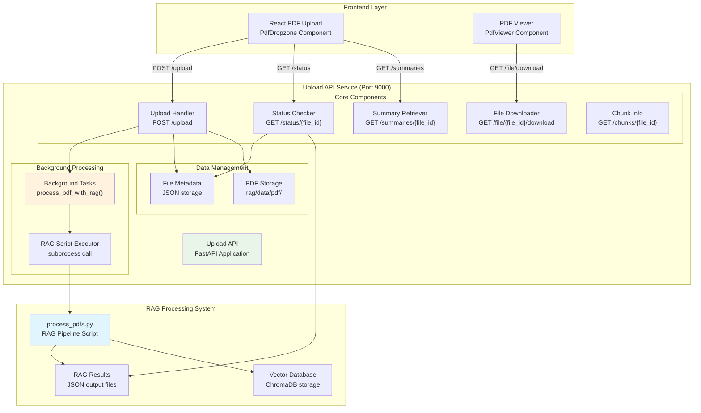
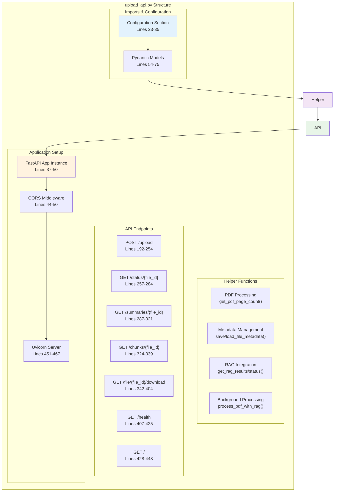
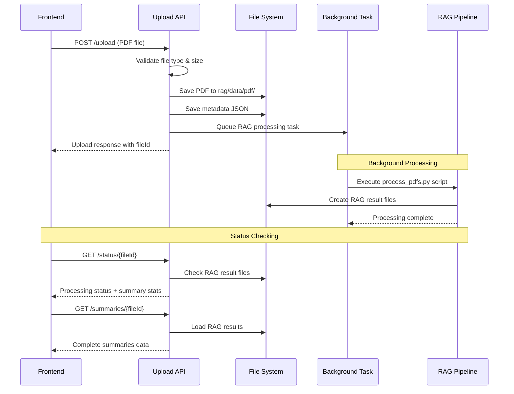

# Upload API System Analysis
## FastAPI PDF Upload Service with RAG Integration

---

## Table of Contents
1. [System Overview](#system-overview)
2. [Architecture Analysis](#architecture-analysis)
3. [Core Components](#core-components)
4. [API Endpoints](#api-endpoints)
5. [Data Flow](#data-flow)
6. [Integration Points](#integration-points)
7. [Configuration & Environment](#configuration--environment)
8. [Error Handling](#error-handling)

---

## System Overview

### File Location
- **Primary File**: `backend/upload_api.py`
- **Related Directories**: 
  - `backend/rag/` - RAG processing pipeline integration
  - `backend/rag/data/pdf/` - PDF storage directory
  - `backend/rag/` - RAG processing scripts (process_pdfs.py)
  - `backend/secrets/` - Environment variables

### Core Purpose
The Upload API service provides a comprehensive PDF file upload system with automatic RAG (Retrieval-Augmented Generation) processing integration. It serves as a bridge between the frontend PDF upload functionality and the backend document processing pipeline.

### Key Features
- **FastAPI-based Web Service** (Port 9000)
- **PDF File Upload & Validation**
- **Automatic RAG Pipeline Integration**
- **Background Task Processing**
- **File Metadata Management**
- **Processing Status Tracking**
- **CORS-enabled for Frontend Integration**

---

## Architecture Analysis

### System Architecture Diagram



### Code Structure Analysis



---

## Core Components

### 1. Configuration System

**Location**: `backend/upload_api.py` lines 23-35

```python
# Configuration - RAG 구조에 맞게 통일
RAG_BASE_DIR = Path("rag")
UPLOAD_DIR = RAG_BASE_DIR / "data" / "pdf"  # RAG PDF 디렉토리와 통일
MAX_FILE_SIZE = 50 * 1024 * 1024  # 50MB
```

**Features**:
- **Unified Directory Structure**: Integrates with existing RAG system
- **Size Limitations**: 50MB maximum file size
- **Environment Integration**: Loads secrets from `backend/secrets/.env`

### 2. Data Models

**Location**: `backend/upload_api.py` lines 54-75

#### Core Models:
- **`UploadResponse`**: API response for file uploads
- **`ChunkInfo`**: Chunk metadata with bounding box information
- **`FileMetadata`**: Complete file information storage

```python
class FileMetadata(BaseModel):
    file_id: str
    original_filename: str
    saved_filename: str  # RAG에서 사용하는 실제 파일명
    page_count: int
    upload_timestamp: str
```

### 3. File Processing Pipeline

**Location**: `backend/upload_api.py` lines 78-143

#### Key Functions:
- **`get_pdf_page_count()`**: PyPDF2-based page counting
- **`save_file_metadata()`**: JSON metadata persistence
- **`get_rag_processing_status()`**: RAG completion detection
- **`get_rag_results()`**: RAG output file loading

### 4. Background Processing System

**Location**: `backend/upload_api.py` lines 145-189

```python
async def process_pdf_with_rag(file_id: str, saved_filename: str):
    """Background task to process PDF with RAG pipeline"""
```

**Features**:
- **Subprocess Execution**: Calls `rag/process_pdfs.py`
- **Timeout Management**: 10-minute processing timeout
- **Error Handling**: Comprehensive error logging
- **Directory Management**: Proper working directory handling

---

## API Endpoints

### 1. File Upload Endpoint

**Route**: `POST /upload`
**Location**: Lines 192-254

#### Request Flow:
1. **File Validation**: PDF type and size checking
2. **Unique ID Generation**: UUID-based file identification
3. **File Storage**: Save to RAG-compatible directory
4. **Metadata Creation**: Store file information
5. **Background Task**: Queue RAG processing

#### Response Format:
```json
{
  "fileId": "uuid_filename",
  "pages": 10,
  "filename": "original.pdf",
  "uploadedAt": "2025-01-19T...",
  "processingStatus": "queued"
}
```

### 2. Status Monitoring Endpoint

**Route**: `GET /status/{file_id}`
**Location**: Lines 257-284

#### Functionality:
- **Processing Status**: queued/processing/completed/failed
- **RAG Results Check**: Automatic detection of completion
- **Summary Statistics**: Count of text/image/table summaries

### 3. Content Retrieval Endpoints

#### Summary Endpoint
**Route**: `GET /summaries/{file_id}`
**Location**: Lines 287-321

Returns processed RAG results including:
- Text summaries
- Image summaries  
- Table summaries

#### Download Endpoint
**Route**: `GET /file/{file_id}/download`
**Location**: Lines 342-404

**Features**:
- **File Resolution**: Smart filename matching
- **Streaming Response**: Efficient large file delivery
- **CORS Headers**: Frontend compatibility
- **URL Encoding**: Safe filename handling

### 4. Utility Endpoints

#### Health Check
**Route**: `GET /health`
**Location**: Lines 407-425

**Monitors**:
- Environment variables (API keys)
- Directory accessibility
- Service status

#### Root Information
**Route**: `GET /`
**Location**: Lines 428-448

**Provides**:
- Service overview
- Available endpoints
- Feature list
- Version information

---

## Data Flow

### Upload Processing Flow



### File Organization Structure

```
backend/rag/data/pdf/
├── original_filename.pdf          # Uploaded PDF file
├── uuid_filename_metadata.json    # File metadata
└── original_filename_0000_0000.json  # RAG processing results
```

---

## Integration Points

### 1. RAG System Integration

**Directory Integration**: Uses `backend/rag/` as base directory
**Script Execution**: Calls `backend/rag/process_pdfs.py`
**Result Detection**: Monitors for `*_0000_0000.json` result files

### 2. Frontend Integration

**CORS Configuration**: Full frontend access enabled
**File Download**: Direct PDF streaming to browser
**Status Polling**: Real-time processing updates

### 3. Multi-Agent System Connection

**File Processing**: Prepares documents for agent consumption
**Metadata Availability**: Structured data for agent queries
**Vector Database**: ChromaDB integration through RAG pipeline

---

## Configuration & Environment

### Required Environment Variables

**Location**: `backend/secrets/.env`

```bash
UPSTAGE_API_KEY=your_upstage_key
OPENAI_API_KEY=your_openai_key  
CLOVASTUDIO_API_KEY=your_clova_key
```

### Directory Structure Requirements

```
backend/
├── upload_api.py
├── rag/
│   ├── data/
│   │   ├── pdf/          # Upload destination
│   │   └── vectordb/     # RAG vector storage
│   └── process_pdfs.py      # RAG pipeline script
└── secrets/
    └── .env
```

### Server Configuration

**Port**: 9000
**Host**: 0.0.0.0 (all interfaces)
**Reload**: Enabled for development
**Timeout**: 10 minutes for RAG processing

---

## Error Handling

### Upload Validation
- **File Type**: Only PDF files accepted
- **File Size**: 50MB maximum limit
- **File Storage**: Comprehensive write error handling

### RAG Processing
- **Timeout Management**: 10-minute processing limit
- **Subprocess Errors**: stderr capture and logging
- **Working Directory**: Proper restoration after processing

### API Error Responses
- **404 Not Found**: File or metadata missing
- **413 Too Large**: File size exceeded
- **500 Internal**: Processing or storage failures

### Status Monitoring
- **Processing States**: queued → processing → completed/failed
- **File Existence**: Validation before operations
- **Result Availability**: Smart detection of completion

---

## Performance Considerations

### Background Processing
- **Non-blocking Upload**: Immediate response after file storage
- **Concurrent Processing**: Multiple files can be processed
- **Resource Management**: Timeout prevents hanging processes

### File Handling
- **Streaming Downloads**: Efficient large file delivery
- **Memory Management**: Direct file-to-response streaming
- **Path Resolution**: Smart filename matching algorithms

### Integration Efficiency
- **Unified Directories**: No file copying between systems
- **Direct RAG Access**: Results available immediately after processing
- **Metadata Caching**: Fast status checks through JSON storage

---

This analysis demonstrates that `upload_api.py` serves as a critical integration point between the frontend PDF handling and the backend RAG processing system, providing a robust, scalable solution for document upload and processing within the multi-agent architecture. 