# Search Agent Architecture Design
## Evolution from News Agent to Comprehensive Search Agent

---

## 🚀 **IMPLEMENTATION UPDATE - COMPLETED**

### **SearchAgent: Production Implementation Status**

This document originally outlined the architecture for a NewsAgent, which has now been **successfully evolved into a comprehensive SearchAgent** with expanded capabilities:

#### ✅ **Implemented Capabilities**
- **🌐 Global Web Search**: Tavily API integration with advanced search capabilities
- **📰 Korean News Search**: Dual Naver News API modes (relevance + date sorting)  
- **🔗 Content Crawling**: Automatic content extraction from search results
- **🤖 Autonomous Reasoning**: ReAct-style intelligent tool selection
- **📊 Comprehensive Analysis**: Agent-driven analysis instead of separate filtering tools

#### ✅ **Key Architectural Changes**
1. **Tool Consolidation**: Removed separate `NewsFilterTool` and `NewsAnalysisTool`
2. **Agent Autonomy**: SearchAgent now handles analysis internally using ReAct reasoning
3. **Multi-Source Search**: Combined web search (Tavily) and Korean news (Naver) capabilities
4. **Enhanced Integration**: Full Supervisor Agent integration with `call_search_agent`

#### ✅ **Production Features**
- **Pure Autonomous Tool Selection**: Agent uses LLM reasoning (NO hard-coded logic) to choose between tools
- **Content Enhancement**: All results include crawled content for deeper analysis  
- **Flexible Search Modes**: Relevance-based and date-based Korean news search
- **Supervisor Coordination**: Seamless integration with multi-agent system

#### 🔧 **Critical Design Corrections Applied**
- **Removed Anti-Pattern**: Eliminated hard-coded `analyze_query_type` and `_recommend_tools` methods
- **True ReAct Implementation**: Agent now operates purely through LLM reasoning guided by system prompts
- **Enhanced Tool Descriptions**: Crystal-clear tool descriptions enable autonomous decision-making
- **No Pre-Processing**: Clean `run` method with no query preprocessing or logical branching
- **Fixed Tavily Integration**: Using official `langchain-tavily` package with correct `TavilySearch` class (not `TavilySearchResults`)
- **Corrected API Usage**: Updated to use proper `invoke()` method and result parsing as per official documentation
- **Corrected Package Dependencies**: Updated requirements.txt to use correct LangChain integration packages

---

## Table of Contents  
1. [Implementation Update](#implementation-update---completed)
2. [Reference Implementation Review](#reference-implementation-review)
3. [Architecture Design (Architect/Designer Role)](#architecture-design-architectdesigner-role)
4. [Architecture Evaluation (Evaluator/Critic Role)](#architecture-evaluation-evaluatorcritic-role)
5. [Refined Architecture Design (Iteration 2)](#refined-architecture-design-iteration-2)
6. [Final Architecture Evaluation](#final-architecture-evaluation)
7. [Implementation Roadmap](#implementation-roadmap)

---

## Reference Implementation Review

### 📋 Overview of `250719_news_agent.ipynb`

The reference notebook demonstrates a complete news analysis pipeline using **ChatClovaX (HCX-005)** and **Naver News API**. Here's the detailed analysis:

### 🔧 Core Components Analysis

#### 1. **Keyword Extraction Module**
```python
# Key Function: keyword_extract(title, context, query)
# Uses ChatClovaX HCX-005 with structured prompt
```

**Strengths:**
- ✅ Sophisticated prompt engineering with clear instructions
- ✅ Handles two question types: concept explanation vs. reasoning
- ✅ Prioritizes company names and core topics
- ✅ Returns structured output (comma-separated keywords)

**Limitations:**
- ❌ No error handling for API failures
- ❌ Fixed to 5 keywords without dynamic adjustment
- ❌ No keyword quality validation

#### 2. **News Search Integration**
```python
# Key Function: search_naver_news(keyword, max_count=50)
# Direct Naver News API integration with pagination
```

**Strengths:**
- ✅ Comprehensive Naver News API integration
- ✅ Pagination support for large result sets
- ✅ Rate limiting considerations (0.2s delay)
- ✅ Filters for Naver News only (`news.naver.com`)

**Limitations:**
- ❌ Single search strategy (combined keywords)
- ❌ No fallback for failed searches
- ❌ Limited to 50 articles max

#### 3. **Intention Analysis**
```python
# Key Function: analyze_intention(title, context, query)
# Sophisticated user intent understanding
```

**Strengths:**
- ✅ Advanced prompt for intent analysis
- ✅ Structured output format
- ✅ Context-aware interpretation

**Limitations:**
- ❌ Single-shot analysis without refinement
- ❌ No confidence scoring

#### 4. **News Filtering Pipeline**
```python
# Key Function: skimming_news(intention, news_list)
# LLM-based relevance filtering in chunks of 5
```

**Strengths:**
- ✅ Intelligent LLM-based filtering
- ✅ Chunked processing to avoid token limits
- ✅ Binary decision making (0/1)

**Limitations:**
- ❌ Fixed chunk size of 5
- ❌ No confidence scoring for decisions
- ❌ Potential inconsistency across chunks

#### 5. **Content Crawling**
```python
# Key Function: crawling_news(articles, output_path)
# BeautifulSoup-based content extraction
```

**Strengths:**
- ✅ Robust error handling for failed requests
- ✅ Extracts full article content
- ✅ User-agent headers for better success rate

**Limitations:**
- ❌ Naver News specific (limited selector)
- ❌ No content quality validation
- ❌ No deduplication logic

### 🎯 Key Insights from Reference Implementation

1. **LLM-First Approach**: Heavy reliance on ChatClovaX for intelligent processing
2. **Structured Prompts**: Well-engineered prompts with clear output formats
3. **Pipeline Architecture**: Clear separation of concerns across 5 stages
4. **Naver News Focus**: Specifically designed for Korean news ecosystem
5. **JSON-Based Storage**: Structured data storage throughout pipeline

---

## Architecture Design (Architect/Designer Role)

### 🏗️ **Initial Draft: News Agent System Architecture**

Based on the reference implementation analysis and the existing multi-agent system structure, I propose the following NewsAgent architecture:

### 1. **Core Agent Components**

```mermaid
flowchart TD
    subgraph "NewsAgent (ChatClovaX HCX-005)"
        NewsLLM[ChatClovaX HCX-005<br/>🧠 News Analysis Intelligence]
        NewsPrompt[News Analysis Prompt<br/>📋 Context-aware Instructions]
        
        subgraph "LangChain Tools"
            KeywordTool[extract_keywords<br/>🔍 Smart Keyword Extraction]
            SearchTool[search_news<br/>📰 Naver News Search]
            FilterTool[filter_news<br/>⚡ Relevance Filtering]
            SummarizeTool[summarize_articles<br/>📝 Content Summarization]
        end
        
        subgraph "React Agent System"
            NewsReactEngine[create_react_agent<br/>🔄 Tool-calling Engine]
            NewsThoughtAction[Thought → Action → Observation<br/>🤔 ReAct Loop]
        end
        
        subgraph "Data Processing Layer"
            NaverAPI[Naver News API Client<br/>📡 Real-time News Access]
            ContentManager[Content Manager<br/>📊 Article Processing]
            IntentionAnalyzer[Intention Analyzer<br/>🎯 Query Understanding]
        end
    end
    
    NewsLLM --> NewsPrompt
    NewsLLM --> NewsReactEngine
    NewsReactEngine --> NewsThoughtAction
    NewsThoughtAction --> KeywordTool
    NewsThoughtAction --> SearchTool
    NewsThoughtAction --> FilterTool
    NewsThoughtAction --> SummarizeTool
    
    KeywordTool --> NaverAPI
    SearchTool --> NaverAPI
    FilterTool --> ContentManager
    SummarizeTool --> IntentionAnalyzer
    
    style NewsLLM fill:#e8f5e8
    style NewsReactEngine fill:#f3e5f5
    style NaverAPI fill:#fff3e0
    style ContentManager fill:#fce4ec
```



### 2. **Tools Provided to the Agent**

#### **A. extract_keywords Tool**
- **Purpose**: Extract relevant search keywords from user queries and context
- **Input**: `query: str, context: str, max_keywords: int = 3`
- **Output**: `List[str]` - Prioritized keywords for news search
- **LLM Integration**: Uses ChatClovaX with sophisticated prompt engineering

#### **B. search_news Tool**
- **Purpose**: Search Naver News API with extracted keywords
- **Input**: `keywords: List[str], max_articles: int = 50, date_range: Optional[str]`
- **Output**: `List[NewsArticle]` - Raw news search results
- **External Dependency**: Naver News API with rate limiting

#### **C. filter_news Tool**
- **Purpose**: Filter news articles by relevance to user query intent
- **Input**: `articles: List[NewsArticle], user_intent: str`
- **Output**: `List[FilteredNewsArticle]` - Relevance-scored articles
- **LLM Integration**: Chunked processing with ChatClovaX

#### **D. summarize_articles Tool**
- **Purpose**: Extract and summarize key information from selected articles
- **Input**: `filtered_articles: List[FilteredNewsArticle], summary_type: str`
- **Output**: `NewsSummary` - Structured summary with key insights
- **LLM Integration**: Advanced summarization with context preservation

### 3. **Environment Management Strategy**

#### **A. State Management**
```python
class NewsAgentState(TypedDict):
    """Extended MessagesState for News Agent"""
    # Inherited from MessagesState
    messages: Annotated[List[BaseMessage], add_messages]
    user_query: Optional[str]
    metadata: Optional[Dict[str, Any]]
    
    # News-specific state
    extracted_keywords: Optional[List[str]]
    search_results: Optional[List[NewsArticle]]
    filtered_articles: Optional[List[FilteredNewsArticle]]
    final_summary: Optional[NewsSummary]
    user_intent: Optional[str]
    search_metadata: Optional[Dict[str, Any]]
```

#### **B. Configuration Management**
- **API Keys**: Secure management of Naver News API credentials
- **Rate Limiting**: Built-in throttling for API calls
- **Caching Strategy**: Redis-based caching for frequently searched terms
- **Error Recovery**: Fallback mechanisms for API failures

#### **C. Data Storage**
- **Raw Data**: JSON storage for search results and article content
- **Processed Data**: Structured storage for filtered and summarized content
- **Cache Management**: TTL-based cache for search results

### 4. **Prompt Design and Management Strategy**

#### **A. Core Prompts Structure**
```python
NEWS_AGENT_SYSTEM_PROMPT = """
# 역할
당신은 **Naver News 검색 및 분석 전문가**입니다.
사용자의 질문에 관련된 최신 뉴스를 검색하고, 핵심 정보를 추출하여 인사이트를 제공합니다.

## 작업 흐름
1. **키워드 추출**: 사용자 질문에서 검색에 적합한 핵심 키워드 추출
2. **뉴스 검색**: Naver News API를 통한 관련 기사 검색
3. **관련성 필터링**: 질문 의도와 일치하는 기사 선별
4. **내용 요약**: 선별된 기사의 핵심 정보 요약 및 인사이트 도출

## 사용 가능한 도구
{tools}

## 중요 지침
- 반드시 최신 뉴스 정보를 기반으로 답변
- 출처를 명확히 표시
- 편향되지 않은 객관적 분석 제공
- 사용자 질문의 의도를 정확히 파악하여 관련성 높은 정보 제공
"""

KEYWORD_EXTRACTION_PROMPT = """
사용자의 질문에서 뉴스 검색에 적합한 핵심 키워드를 추출합니다.

규칙:
1. 기업명, 제품명, 기술명 우선 추출
2. 최대 {max_keywords}개 키워드
3. 검색 효율성을 고려한 키워드 조합
4. 쉼표로 구분된 결과 반환

질문: {query}
문맥: {context}
"""

RELEVANCE_FILTERING_PROMPT = """
뉴스 기사와 사용자 질문의 관련성을 평가합니다.

평가 기준:
1. 질문 의도와의 직접적 연관성
2. 정보의 신뢰성과 구체성
3. 시간적 적절성

출력 형식: [1, 0, 1, 0, 1] (관련성 있음=1, 없음=0)
"""
```

#### **B. Dynamic Prompt Management**
- **Context-Aware Prompts**: Date-aware prompts with current information
- **Query Type Detection**: Different prompts for different question types
- **Iterative Refinement**: Prompt adjustment based on result quality

### 5. **LLM Invocation and Integration Method**

#### **A. Multi-Stage LLM Integration**
```python
class NewsAgentLLMManager:
    def __init__(self):
        self.primary_llm = ChatClovaX(model="HCX-005", temperature=0.1)
        self.creative_llm = ChatClovaX(model="HCX-005", temperature=0.3)
    
    def extract_keywords(self, query: str, context: str) -> List[str]:
        """Conservative LLM for structured keyword extraction"""
        return self.primary_llm.invoke(keyword_prompt)
    
    def analyze_intent(self, query: str) -> str:
        """Understanding user intent with moderate creativity"""
        return self.primary_llm.invoke(intent_prompt)
    
    def filter_relevance(self, articles: List, intent: str) -> List[int]:
        """Strict relevance filtering with low temperature"""
        return self.primary_llm.invoke(filter_prompt)
    
    def generate_summary(self, articles: List) -> str:
        """Creative summarization with higher temperature"""
        return self.creative_llm.invoke(summary_prompt)
```

#### **B. Token Management**
- **Chunked Processing**: Break large article lists into manageable chunks
- **Smart Truncation**: Intelligent content truncation for token limits
- **Context Preservation**: Maintain important context across chunks

#### **C. Error Handling and Fallbacks**
- **API Retry Logic**: Exponential backoff for failed LLM calls
- **Graceful Degradation**: Fallback to simpler processing on failures
- **Quality Validation**: Output validation and re-processing if needed

### 6. **Integration with Existing Multi-Agent System**

#### **A. Supervisor Integration**
```python
# Add to Supervisor Agent's tool registry
@tool("call_news_agent")
def call_news_agent(
    request: str,
    state: Annotated[Dict[str, Any], InjectedState]
) -> str:
    """
    Call News Agent for news search and analysis
    
    Args:
        request: News analysis request with company/topic/timeframe
        state: Current graph state (injected automatically)
    """
    news_agent = NewsAgent()
    return news_agent.run(request)
```

#### **B. Shared State Integration**
- **MessagesState Extension**: Extend existing state with news-specific fields
- **Cross-Agent Communication**: Share insights between Stock and News agents
- **Unified Output Format**: Consistent response format across agents

### 7. **Architecture Benefits**

✅ **Scalability**: Modular design allows independent scaling of components  
✅ **Reliability**: Multi-layer error handling and fallback mechanisms  
✅ **Maintainability**: Clear separation of concerns and well-defined interfaces  
✅ **Extensibility**: Easy addition of new news sources and analysis tools  
✅ **Performance**: Optimized LLM usage with caching and smart chunking  
✅ **Integration**: Seamless integration with existing multi-agent system  

### 8. **Architecture Constraints**

⚠️ **API Dependency**: Heavy reliance on Naver News API availability  
⚠️ **Rate Limiting**: Naver API rate limits may impact performance  
⚠️ **Language Limitation**: Optimized for Korean news sources  
⚠️ **Cost Considerations**: Multiple LLM calls increase operational costs  
⚠️ **Latency**: Multi-stage processing may introduce response delays  
⚠️ **Content Quality**: Dependent on news source quality and availability  

---

## Architecture Evaluation (Evaluator/Critic Role)

### 🔍 **Critical Analysis of Proposed Architecture**

Now, switching to the **Evaluator/Critic role**, I will systematically analyze the proposed architecture:

### 1. **Tool Sufficiency and Efficiency Analysis**

#### **❌ Critical Issues with Tool Design:**

**A. extract_keywords Tool:**
- **Missing Tool**: No keyword validation or refinement mechanism
- **Inefficiency**: Fixed keyword count without dynamic adjustment based on query complexity
- **Risk**: Poor keyword extraction could cascade failures through entire pipeline

**B. search_news Tool:**
- **Single Point of Failure**: Only Naver News API with no alternative sources
- **Limited Search Strategy**: Only combined keyword search, no alternative search patterns
- **Missing Feature**: No temporal filtering or search result ranking

**C. filter_news Tool:**
- **Scalability Issue**: Chunking size of 5 is arbitrary and may not be optimal
- **No Confidence Scoring**: Binary 0/1 decisions lack nuance
- **Consistency Risk**: Different chunks may have inconsistent filtering criteria

**D. summarize_articles Tool:**
- **Unclear Scope**: Tool purpose is too broad without specific summarization types
- **No Quality Control**: No mechanism to validate summary quality
- **Missing Feature**: No sentiment analysis or bias detection

#### **✅ Recommended Tool Improvements:**

1. **Add keyword_validation Tool**: Validate and refine extracted keywords
2. **Add search_fallback Tool**: Alternative search strategies when primary fails
3. **Add content_quality_scorer Tool**: Score article quality and reliability
4. **Add duplicate_detector Tool**: Identify and remove duplicate articles

### 2. **Environment Management Strategy Assessment**

#### **❌ Significant Gaps:**

**A. State Management:**
- **Complexity**: NewsAgentState is too complex with too many optional fields
- **State Persistence**: No clear strategy for state persistence across sessions
- **Rollback Mechanism**: No way to recover from partial failures

**B. Configuration Management:**
- **Security Risk**: API key management strategy is not detailed enough
- **Configuration Drift**: No version control for configuration changes
- **Environment Isolation**: No clear separation between dev/staging/prod configs

**C. Error Recovery:**
- **Incomplete**: Fallback mechanisms are mentioned but not detailed
- **Monitoring Gap**: No observability strategy for system health
- **Data Consistency**: No strategy for handling partial data corruption

#### **✅ Recommended Environment Improvements:**

1. **Implement State Snapshots**: Save state at each major step for recovery
2. **Add Configuration Versioning**: Track configuration changes
3. **Implement Health Checks**: Regular system health monitoring
4. **Add Data Validation**: Validate data integrity at each stage

### 3. **Prompt Design Strategy Critique**

#### **❌ Prompt Engineering Weaknesses:**

**A. Static Prompts:**
- **Inflexibility**: Prompts are too rigid for diverse query types
- **No Learning**: No mechanism to improve prompts based on results
- **Context Loss**: Prompts don't maintain context across tool calls

**B. Prompt Testing:**
- **No Validation**: No systematic prompt testing methodology
- **No A/B Testing**: No way to compare prompt effectiveness
- **No Metrics**: No quantitative measures of prompt performance

**C. Localization Issues:**
- **Language Mixing**: Korean and English mixed in prompts may confuse model
- **Cultural Context**: Prompts may not handle Korean business context well

#### **✅ Recommended Prompt Improvements:**

1. **Dynamic Prompt Templates**: Adaptive prompts based on query characteristics
2. **Prompt Performance Metrics**: Track prompt effectiveness quantitatively
3. **Systematic Prompt Testing**: A/B testing framework for prompt optimization
4. **Cultural Adaptation**: Korean business context-aware prompt engineering

### 4. **LLM Integration Efficiency Critique**

#### **❌ Major Efficiency Concerns:**

**A. Cost Optimization:**
- **Excessive LLM Calls**: Multiple LLM calls for simple operations
- **No Caching**: Repeated similar queries result in redundant API calls
- **Token Waste**: Poor token management leads to unnecessary costs

**B. Latency Issues:**
- **Sequential Processing**: Many operations that could be parallel are sequential
- **Synchronous Calls**: All LLM calls are synchronous, increasing latency
- **No Streaming**: No streaming responses for better user experience

**C. Performance Bottlenecks:**
- **Single LLM Instance**: No load balancing across multiple LLM instances
- **No Batching**: Individual processing instead of batch processing where possible
- **Memory Inefficiency**: Large article content loaded entirely into memory

#### **✅ Recommended LLM Integration Improvements:**

1. **Implement Intelligent Caching**: Cache frequent query patterns
2. **Add Parallel Processing**: Run independent LLM calls in parallel
3. **Implement Streaming**: Stream responses for better UX
4. **Add Batch Processing**: Process multiple similar requests together

### 5. **Overall System Goals Achievement Assessment**

#### **❌ Critical System-Level Issues:**

**A. Scalability Concerns:**
- **Monolithic Design**: Agent is too tightly coupled to scale independently
- **Resource Contention**: Multiple agents competing for same LLM resources
- **Data Storage**: No clear strategy for handling large volumes of news data

**B. Reliability Gaps:**
- **Single Points of Failure**: Multiple critical dependencies without failovers
- **No Circuit Breakers**: No protection against cascading failures
- **Insufficient Monitoring**: Limited observability into system health

**C. Maintainability Issues:**
- **Complex Dependencies**: Too many interdependent components
- **No Versioning Strategy**: No clear component versioning approach
- **Testing Gaps**: Limited testing strategy for complex LLM interactions

### 6. **Bottlenecks and Single Points of Failure**

#### **❌ Critical Vulnerabilities:**

1. **Naver API Dependency**: Complete reliance on single news source
2. **ChatClovaX Dependency**: No fallback LLM options
3. **Sequential Processing**: Each stage blocks the next
4. **Memory Bottlenecks**: Large article processing in memory
5. **Network Dependencies**: Multiple external API dependencies

### 7. **Simpler/More Efficient Alternatives**

#### **🔄 Alternative Architecture Recommendations:**

1. **Hybrid Approach**: Combine rule-based and LLM-based processing
2. **Event-Driven Architecture**: Asynchronous processing with message queues
3. **Microservices Pattern**: Separate services for each major function
4. **Pre-computed Indexes**: Build searchable indexes for faster retrieval

---

## Refined Architecture Design (Iteration 2)

### 🔄 **Improved News Agent Architecture**

Based on the critical evaluation, here's the refined architecture addressing the identified issues:

### 1. **Enhanced Tool Architecture**

```mermaid
flowchart TD
    subgraph "Refined NewsAgent Tools"
        subgraph "Smart Search Tools"
            ExtractTool[extract_keywords<br/>🔍 + validation]
            SearchTool[search_news<br/>📰 + fallbacks]
            FallbackTool[search_fallback<br/>🔄 alternative sources]
        end
        
        subgraph "Content Processing Tools"
            FilterTool[filter_news<br/>⚡ + confidence scoring]
            QualityTool[assess_content_quality<br/>📊 reliability scoring]
            DeduplicateTool[deduplicate_articles<br/>🔄 duplicate removal]
        end
        
        subgraph "Analysis Tools"
            SummarizeTool[summarize_articles<br/>📝 + sentiment analysis]
            InsightTool[extract_insights<br/>💡 key findings]
            ValidateTool[validate_summary<br/>✅ quality check]
        end
    end
    
    ExtractTool --> SearchTool
    SearchTool --> FallbackTool
    FilterTool --> QualityTool
    QualityTool --> DeduplicateTool
    SummarizeTool --> InsightTool
    InsightTool --> ValidateTool
    
    style ExtractTool fill:#e8f5e8
    style SearchTool fill:#f3e5f5
    style FilterTool fill:#fff3e0
    style SummarizeTool fill:#fce4ec
```



### 2. **Robust Environment Management**

#### **A. Enhanced State Management**
```python
class NewsAgentState(TypedDict):
    """Simplified and robust state management"""
    # Core inherited state
    messages: Annotated[List[BaseMessage], add_messages]
    user_query: str
    
    # News workflow state with clear progression
    current_stage: Literal["init", "keyword_extraction", "search", "filter", "summarize", "complete"]
    
    # Workflow results with validation
    keywords: Optional[ValidatedKeywords]
    search_results: Optional[ValidatedSearchResults]
    filtered_articles: Optional[ScoredArticles]
    final_summary: Optional[ValidatedSummary]
    
    # Error handling and recovery
    errors: List[ProcessingError]
    fallback_used: List[str]
    
    # Performance metadata
    processing_metadata: ProcessingMetadata
```

#### **B. Configuration Management with Versioning**
```python
class NewsAgentConfig:
    """Versioned configuration management"""
    version: str = "1.0.0"
    
    # API configurations with fallbacks
    naver_api: NaverAPIConfig
    backup_sources: List[NewsSourceConfig]
    
    # Processing parameters with validation
    max_keywords: int = Field(ge=1, le=10, default=3)
    max_articles: int = Field(ge=10, le=100, default=50)
    chunk_size: int = Field(ge=3, le=10, default=5)
    
    # Performance configurations
    timeout_seconds: int = 30
    max_retries: int = 3
    cache_ttl: int = 3600
```

### 3. **Adaptive Prompt Management**

#### **A. Dynamic Prompt Templates**
```python
class AdaptivePromptManager:
    """Context-aware prompt management"""
    
    def get_keyword_prompt(self, query_type: str, complexity: int) -> str:
        """Dynamic keyword extraction prompts based on query analysis"""
        base_template = self.templates[f"keyword_extract_{query_type}"]
        return base_template.format(
            max_keywords=min(3 + complexity, 7),
            focus_area=self.detect_focus_area(query_type)
        )
    
    def get_filtering_prompt(self, intent_confidence: float) -> str:
        """Adaptive filtering prompts based on intent clarity"""
        if intent_confidence > 0.8:
            return self.templates["precise_filtering"]
        else:
            return self.templates["broad_filtering"]
```

### 4. **Optimized LLM Integration**

#### **A. Intelligent Processing Pipeline**
```python
class OptimizedLLMManager:
    """Performance-optimized LLM integration"""
    
    def __init__(self):
        self.cache = RedisCache(ttl=3600)
        self.rate_limiter = RateLimiter(calls_per_minute=30)
        self.llm_pool = ChatClovaXPool(size=3)
    
    async def process_with_cache(self, operation: str, input_data: str) -> str:
        """Cached LLM processing with parallel execution"""
        cache_key = f"{operation}:{hash(input_data)}"
        
        if cached_result := await self.cache.get(cache_key):
            return cached_result
        
        result = await self.llm_pool.process_async(operation, input_data)
        await self.cache.set(cache_key, result)
        return result
    
    async def batch_filter_articles(self, articles: List, intent: str) -> List[int]:
        """Parallel processing of article chunks"""
        chunks = self.create_optimal_chunks(articles)
        
        tasks = [
            self.process_chunk_async(chunk, intent) 
            for chunk in chunks
        ]
        
        results = await asyncio.gather(*tasks)
        return self.merge_chunk_results(results)
```

### 5. **Resilient Architecture Patterns**

#### **A. Circuit Breaker Pattern**
```python
class NewsAgentWithCircuitBreaker:
    """Circuit breaker for external dependencies"""
    
    def __init__(self):
        self.naver_circuit = CircuitBreaker(
            failure_threshold=5,
            timeout=60,
            fallback=self.use_backup_sources
        )
        self.llm_circuit = CircuitBreaker(
            failure_threshold=3,
            timeout=30,
            fallback=self.use_cached_responses
        )
    
    @circuit_breaker(circuit="naver_circuit")
    async def search_news(self, keywords: List[str]) -> List[Article]:
        """Protected news search with fallback"""
        return await self.naver_api.search(keywords)
    
    def use_backup_sources(self, keywords: List[str]) -> List[Article]:
        """Fallback to alternative news sources"""
        return self.backup_search_engine.search(keywords)
```

### 6. **Performance Monitoring and Observability**

#### **A. Comprehensive Metrics Collection**
```python
class NewsAgentMetrics:
    """Performance and quality metrics"""
    
    def __init__(self):
        self.metrics = MetricsCollector()
    
    def track_operation(self, operation: str, duration: float, success: bool):
        """Track operation performance"""
        self.metrics.histogram("news_agent.operation.duration", duration, tags={"op": operation})
        self.metrics.increment("news_agent.operation.count", tags={"op": operation, "success": success})
    
    def track_quality_score(self, component: str, score: float):
        """Track output quality scores"""
        self.metrics.gauge("news_agent.quality.score", score, tags={"component": component})
```

### 7. **Integration Improvements**

#### **A. Enhanced Supervisor Handoff**
```python
@tool("call_news_agent")
def call_news_agent(
    request: str,
    context: Optional[Dict] = None,
    state: Annotated[Dict[str, Any], InjectedState] = None
) -> str:
    """
    Enhanced News Agent integration with context sharing
    
    Args:
        request: Natural language news analysis request
        context: Optional context from other agents (e.g., stock symbols from Stock Agent)
        state: Current graph state
    """
    try:
        news_agent = NewsAgent()
        
        # Share relevant context between agents
        if context and "stock_symbols" in context:
            request += f" (관련 종목: {', '.join(context['stock_symbols'])})"
        
        result = await news_agent.run_async(request)
        
        # Update shared state with news insights
        if state and "news_insights" not in state:
            state["news_insights"] = []
        state["news_insights"].append(result.key_insights)
        
        return result.formatted_response
        
    except Exception as e:
        logger.error(f"News Agent error: {e}")
        return f"뉴스 분석 중 오류 발생: {str(e)}"
```

---

## Final Architecture Evaluation

### ✅ **Improvements Achieved**

1. **Tool Efficiency**: Added validation, fallbacks, and quality scoring
2. **Environment Robustness**: Implemented state persistence, configuration versioning, and health monitoring
3. **Prompt Adaptability**: Dynamic prompts based on context and performance
4. **LLM Optimization**: Caching, parallel processing, and intelligent chunking
5. **System Resilience**: Circuit breakers, fallbacks, and comprehensive error handling
6. **Observability**: Detailed metrics and monitoring capabilities

### ⚠️ **Remaining Considerations**

1. **Complexity Trade-off**: Increased sophistication may impact maintainability
2. **Resource Requirements**: Enhanced features require more infrastructure
3. **Testing Complexity**: More components require more comprehensive testing
4. **Deployment Complexity**: More moving parts increase deployment challenges

### 🎯 **Final Recommendation**

The refined architecture successfully addresses the critical issues identified in the initial design while maintaining integration compatibility with the existing multi-agent system. The improvements in reliability, performance, and observability justify the increased complexity.

**Key Success Factors:**
- Gradual implementation starting with core functionality
- Comprehensive testing at each integration point
- Performance monitoring from day one
- Clear fallback strategies for all external dependencies

---


This architecture design provides a solid foundation for implementing a robust, scalable, and maintainable NewsAgent that seamlessly integrates with the existing multi-agent system while addressing the critical requirements identified in the reference implementation. 