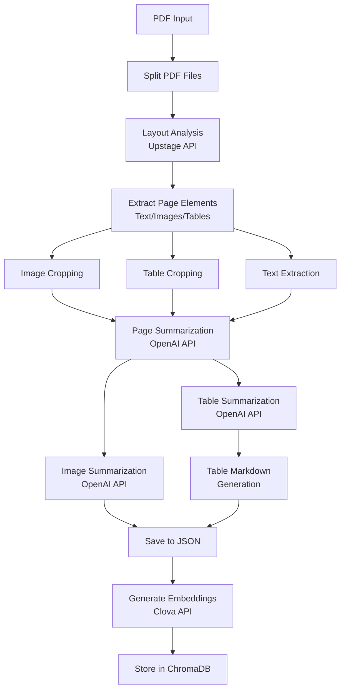

# RAG Project Documentation

## Overview

The RAG (Retrieval-Augmented Generation) project located in `backend/rag/` is a sophisticated PDF processing pipeline that extracts, analyzes, and stores document content in a vector database for semantic search and retrieval.

## 1. Endpoint Scripts & Execution Order

### Primary Execution Scripts

**1. `rag/scripts/process_pdfs.py`** - Main PDF Processing Pipeline
```bash
cd backend/rag
python scripts/process_pdfs.py [--limit N]
```
- **Purpose**: Processes raw PDF files through layout analysis, element extraction, and summarization
- **Arguments**: 
  - `--limit N` (optional): Limits processing to N PDF files
- **Output**: Creates `processed_states.json` with extracted summaries and metadata

**2. `rag/scripts/import_to_chroma.py`** - Vector Database Import
```bash
cd backend/rag
python scripts/import_to_chroma.py [json_path]
```
- **Purpose**: Imports processed PDF data into ChromaDB vector store
- **Arguments**: 
  - `json_path` (optional): Path to processed states JSON file (defaults to `./data/vectordb/processed_states.json`)
- **Output**: Populates ChromaDB with document embeddings

**3. `rag/scripts/check_states.py`** - State Verification
```bash
cd backend/rag
python scripts/check_states.py
```
- **Purpose**: Validates processing results and checks for errors
- **Output**: Reports summary counts and identifies issues

### Automated Pipeline Script

**`rag/scripts/run_pipeline.sh`** - Complete Pipeline Execution
```bash
cd backend/rag
chmod +x scripts/run_pipeline.sh
./scripts/run_pipeline.sh
```
Executes the full pipeline in order:
1. Process PDFs
2. Check processed states  
3. Start API server

## 2. Directory Structure & File Placement

### Source PDF Placement
```
backend/rag/data/pdf/
├── your_report_1.pdf
├── your_report_2.pdf
└── 20250513_카카오페이 (377300_매수).pdf  # Example file
```
- **Location**: Place new PDF reports in `backend/rag/data/pdf/`
- **Format**: Standard PDF files (.pdf extension)
- **Processing**: Only original PDFs are processed (split files are ignored)

### Vector Database Storage
```
backend/rag/data/vectordb/
├── chroma.sqlite3          # ChromaDB database
├── processed_states.json   # Processing state tracking
└── [collection_files]      # Vector embeddings and metadata
```
- **Location**: `backend/rag/data/vectordb/`
- **Contents**: ChromaDB collections and processing state

### Complete Directory Layout
```
backend/rag/
├── data/
│   ├── logs/           # Processing logs
│   ├── pdf/            # Source PDF files
│   └── vectordb/       # ChromaDB storage + state tracking
├── scripts/            # Execution scripts
│   ├── process_pdfs.py
│   ├── import_to_chroma.py
│   ├── check_states.py
│   └── run_pipeline.sh
├── src/                # Core processing modules
│   ├── graphparser/    # PDF parsing workflow nodes
│   ├── utils/          # Utility functions (embeddings, MongoDB)
│   ├── data_collection/# Web crawling and database
│   ├── parser.py       # Main parsing pipeline
│   └── vectorstore.py  # Vector store management
└── requirements.txt    # Python dependencies
```

## 3. Required Environment Variables & API Keys

### Environment Configuration
Create a `.env` file in `backend/rag/` with the following variables:

```env
# Layout Analysis (Upstage Document AI)
UPSTAGE_API_KEY=your_upstage_api_key_here

# AI Summarization (OpenAI GPT)
OPENAI_API_KEY=your_openai_api_key_here

# Text Embeddings (Clova Studio)
CLOVA_API_KEY=your_clova_api_key_here
```

### API Key Usage Mapping

| API Key | Module | Usage |
|---------|--------|-------|
| `UPSTAGE_API_KEY` | `src/graphparser/core.py::LayoutAnalyzerNode` | PDF layout analysis and element detection |
| `OPENAI_API_KEY` | `src/graphparser/core.py::CreatePageSummaryNode`<br>`src/graphparser/core.py::CreateImageSummaryNode`<br>`src/graphparser/core.py::CreateTableSummaryNode` | Text, image, and table summarization |
| `CLOVA_API_KEY` | `src/utils/clova_embeddings.py::ClovaEmbeddings` | Text embedding generation for vector search |

## 4. Module Responsibilities & Pipeline Flow

### Core Modules

| Module | Responsibility |
|--------|----------------|
| `scripts/` | Execution orchestration and pipeline management |
| `src/graphparser/` | PDF parsing workflow nodes (LangGraph-based) |
| `src/parser.py` | Main parsing pipeline coordinator |
| `src/vectorstore.py` | ChromaDB vector store management |
| `src/utils/` | Utility functions (embeddings, database connections) |
| `src/data_collection/` | Web crawling and external data ingestion |

### Processing Pipeline Flow



### Detailed Step-by-Step Flow

1. **PDF Split** (`SplitPDFFilesNode`): Divides large PDFs into manageable batches
2. **Layout Analysis** (`LayoutAnalyzerNode`): Uses Upstage API to identify document structure
3. **Element Extraction** (`ExtractPageElementsNode`): Parses layout data into text, image, and table elements
4. **Content Cropping**: 
   - `ImageCropperNode`: Extracts image regions
   - `TableCropperNode`: Extracts table regions
   - `ExtractPageTextNode`: Extracts text content
5. **Summarization**:
   - `CreatePageSummaryNode`: Generates page-level summaries
   - `CreateImageSummaryNode`: Analyzes and summarizes images
   - `CreateTableSummaryNode`: Analyzes and summarizes tables
6. **Markdown Generation** (`TableMarkdownExtractorNode`): Converts tables to markdown format
7. **State Persistence**: Saves processing results to `processed_states.json`
8. **Vector Storage**: Generates embeddings and stores in ChromaDB for retrieval

## 5. Runtime Environment & Package Requirements

### Python Version
- **Recommended**: Python 3.8 or higher
- **Required**: Python 3.7+

### Virtual Environment Setup
```bash
# Navigate to RAG directory
cd backend/rag

# Create virtual environment
python -m venv .venv

# Activate virtual environment
# On Windows:
.venv\Scripts\activate
# On macOS/Linux:
source .venv/bin/activate

# Install dependencies
pip install -r requirements.txt
```

### Key Dependencies from `requirements.txt`

**Core Framework:**
```
pandas>=2.2.2
chromadb==0.4.24
langchain>=0.2.5
langchain-community>=0.0.1
langchain-chroma>=0.1
langgraph>=0.0
```

**PDF Processing:**
```
pymupdf>=1.24.1
pypdf>=4.2.0
pdfplumber>=0.11.1
pdfminer-six>=20231228
```

**API & Web Services:**
```
fastapi>=0.110.0
uvicorn[standard]>=0.27.1
requests>=2.31.0
openai
python-dotenv>=1.0.1
```

**ML & Embeddings:**
```
sentence-transformers
langchain-huggingface
huggingface-hub>=0.23
tiktoken>=0.7
numpy==1.26.4
```

**Database & Storage:**
```
pymongo[srv]>=4.6.1
boto3>=1.34.0
s3fs>=2024.2.0
```

**Utilities:**
```
tqdm
tenacity==8.3.0
click>=7.0
psutil
pytz==2024.1
```

## 6. Usage Instructions

### Step-by-Step Setup and Execution

1. **Environment Setup**
```bash
cd backend/rag
python -m venv .venv
source .venv/bin/activate  # or .venv\Scripts\activate on Windows
pip install -r requirements.txt
```

2. **Configure API Keys**
```bash
# Create .env file with required API keys
echo "UPSTAGE_API_KEY=your_key" >> .env
echo "OPENAI_API_KEY=your_key" >> .env  
echo "CLOVA_API_KEY=your_key" >> .env
```

3. **Place PDF Files**
```bash
# Copy your PDF reports to the data/pdf directory
cp /path/to/your/reports/*.pdf data/pdf/
```

4. **Run Processing Pipeline**
```bash
# Option 1: Run complete pipeline
chmod +x scripts/run_pipeline.sh
./scripts/run_pipeline.sh

# Option 2: Run steps individually
python scripts/process_pdfs.py --limit 5  # Process up to 5 PDFs
python scripts/check_states.py            # Verify processing
python scripts/import_to_chroma.py        # Import to vector DB
```

5. **Verify Results**
```bash
# Check processing status
python scripts/check_states.py

# Verify vector database content
ls -la data/vectordb/
```

### State Management

The system tracks processing state in `data/vectordb/processed_states.json`:
- **`parsing_processed`**: PDF has been processed through the parsing pipeline
- **`vectorstore_processed`**: Data has been imported into ChromaDB
- **Summary counts**: Text, image, and table summaries generated

### Performance Considerations

- **Memory Usage**: Large PDFs may require significant RAM for layout analysis
- **API Rate Limits**: Upstage and OpenAI APIs have rate limits; processing includes retry logic
- **Processing Time**: Complex documents with many images/tables take longer to process
- **Batch Processing**: Use `--limit` parameter to process files in smaller batches

## Additional Notes

- The system automatically skips already-processed files based on state tracking
- Split PDF files (with `_YYYY_ZZZZ.pdf` pattern) are ignored as originals
- ChromaDB collections use the "pdf_collection" name by default
- All text processing preserves UTF-8 encoding for Korean language support
- The pipeline is designed to be resumable - failed processing can be retried
- Vector embeddings use Clova Studio's BGE-M3 model for multilingual support